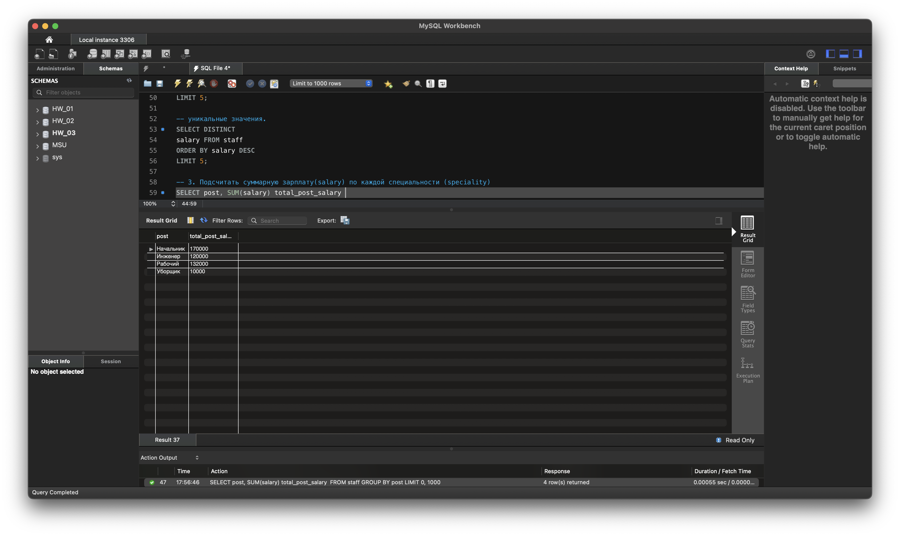

-- Таблица для работы на слайде. 

CREATE DATABASE HW_03; 
USE HW_03; 

CREATE TABLE staff 
( 
    id INT PRIMARY KEY AUTO_INCREMENT, 
    firstname VARCHAR(100) NOT NULL, 
    lastname VARCHAR(100) NOT NULL, 
    post VARCHAR(100) NOT NULL, 
    seniority TINYINT UNSIGNED NOT NULL, 
    salary DECIMAL DEFAULT 0, 
    age TINYINT UNSIGNED NOT NULL  
); 

INSERT staff (firstname, lastname, post, seniority, salary, age) 
VALUES  
	('Вася', 'Петров', 'Начальник', 40, 100000, 60), 
    ('Петр', 'Власов', 'Начальник', 8, 70000, 30), 
    ('Катя', 'Катина', 'Инженер', 2, 70000, 25), 
    ('Саша', 'Сасин', 'Инженер', 12, 50000, 35), 
    ('Иван', 'Иванов', 'Рабочий', 40, 30000, 59), 
    ('Петр', 'Петров', 'Рабочий', 20, 25000, 40), 
    ('Сидр', 'Сидоров', 'Рабочий', 10, 20000, 35), 
    ('Антон', 'Антонов', 'Рабочий', 8, 19000, 28), 
    ('Юрий', 'Юрков', 'Рабочий', 5, 15000, 25), 
    ('Максим', 'Максимов', 'Рабочий', 2, 11000, 22), 
    ('Юрий', 'Галкин', 'Рабочий', 3, 12000, 24), 
    ('Людмила', 'Маркина', 'Уборщик', 10, 10000, 49); 
    
SELECT * FROM staff; 

-- 1. Отсортируйте данные по полю заработная плата (salary) в порядке: убывания;  

SELECT *  
FROM staff  
ORDER BY salary DESC; 

-- возрастания 

SELECT *  
FROM staff  
ORDER BY salary; 

-- 2. Выведите 5 максимальных зарплат (salary) 
SELECT *  
FROM staff  
ORDER BY salary DESC 
LIMIT 5; 

-- уникальные значения. 
SELECT DISTINCT  
salary FROM staff  
ORDER BY salary DESC 
LIMIT 5; 

-- 3. Подсчитать суммарную зарплату(salary) по каждой специальности (speciality) 
SELECT post, SUM(salary) total_post_salary  
FROM staff 
GROUP BY post; 

-- 4. Найти количество сотрудников по специальности “Рабочий” (speciality) в возрасте от 24 до 49 лет. 
SELECT COUNT(*) 'Кол-во рабочих 24-49 лет' FROM staff 
WHERE post = 'Рабочий' AND age BETWEEN 24 AND 49; 

-- 5. Найти количество специальностей 
SELECT  
COUNT(DISTINCT post)  
'Количество специальностей'  
FROM staff; 

-- 6. Вывести специальности, у которых средний возраст сотрудника меньше 30 лет 
SELECT post, avg(age) 
FROM staff 
GROUP BY post 
HAVING AVG(age) < 30; 

 
## Минимальный средний возраст по должностям равен 30, поэтому запрос №6 ничего не выдал.
SELECT post, avg(age) 
FROM staff 
GROUP BY post; 

